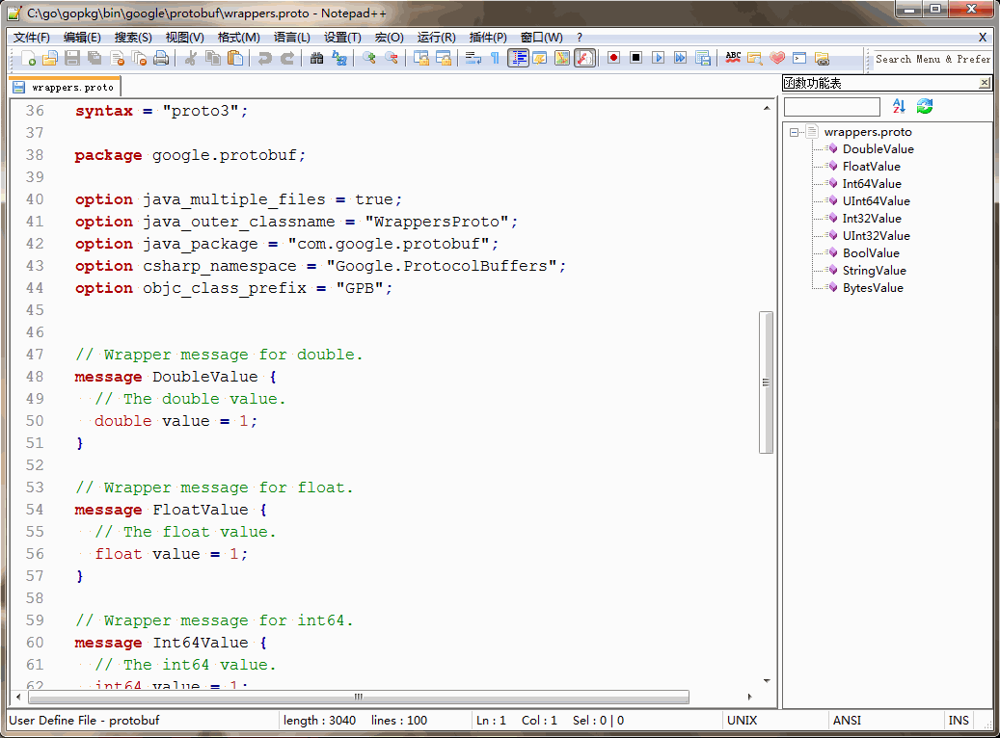
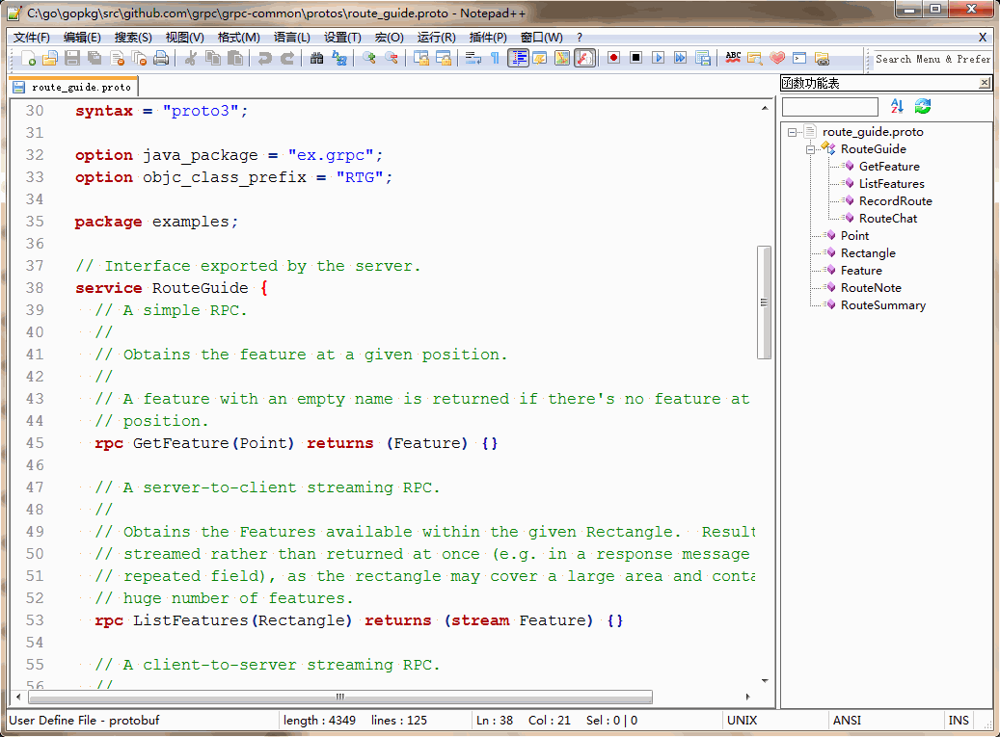

Notepad++ syntax highlighting
-----------------------------

The `userDefineLang.xml` uses the new User Defined Language system (`UDL2`),
which needs `Notepad++ v6.2` or higher.

Installation

  1. Download `userDefineLang.xml` from this repository
  2. Open the UDL Dialog (Language > User Defined Language > Define Your Language...)
  3. Import the downloaded file (via the "Import..." button)
  4. Restart Notepad++

**Reference:**

  1. https://npp-user-manual.org/docs/user-defined-language-system/

Notepad++ Function List
-----------------------

The `functionList.xml` uses the Function List Pane new feature,
which needs Notepad++ v6.4 or higher.

Installation

  1. Close Notepad++
  2. Navigate to the `functionList` folder in the Notepad++ application data directory (`%APPDATA%/Notepad++/functionList`, if using the installer)
  3. Copy `functionList/protobuf.xml` (from this repository) into the folder
  4. Incorporate the contents of `functionList/add_to_overrideMap.xml` (from this repository) into the `overrideMap.xml` file

**Reference:**

  1. https://npp-user-manual.org/docs/function-list/

Screenshots
-----------

BUGS
----

Please report bugs to <chaishushan@gmail.com>.

Thanks!
